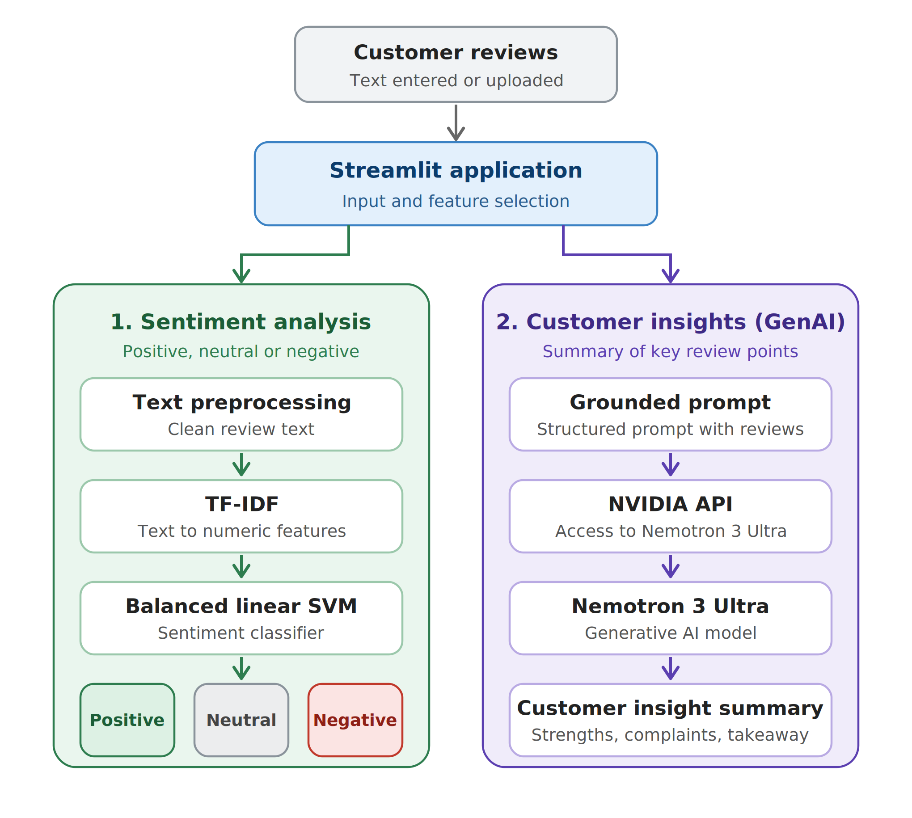

# NLP Automated Customer Reviews

An NLP project developed during the Ironhack AI Engineering Bootcamp to analyze customer reviews using Machine Learning and Generative AI.

The project transforms raw customer feedback into useful insights through three main NLP tasks:

- **Sentiment Analysis** — classify reviews as Positive, Neutral, or Negative.
- **Review Clustering** — group reviews into meaningful customer feedback categories.
- **GenAI Summarization** — generate concise customer insight summaries from multiple reviews.

The final sentiment classification model is deployed as a public **Streamlit application**. Generative AI summarization was developed and evaluated separately as part of the project experimentation.


## Live Application

The sentiment analysis model is deployed as a public Streamlit application.

**Try the application:**  
https://project-nlp-customer-reviews-df-cm-kievtwuaanpsje67qlxslr.streamlit.app/ 

Users can enter a customer review and receive a sentiment prediction:
- Positive
- Neutral
- Negative

The deployed application uses the final Balanced Linear SVM model with TF-IDF text representation.


## Business Problem

Companies can receive thousands of customer reviews, making manual analysis slow and difficult.

This project explores how NLP can help automatically answer two simple questions:

1. **What is the customer sentiment?**
2. **What are customers mainly saying about the product?**

The goal is to turn large amounts of unstructured review text into information that is easier to understand and use.

Working hypothesis: Review text contains enough information to predict sentiment, but the strong class imbalance is expected to reduce performance on the minority classes.


## Dataset

The project uses the **Amazon Product Reviews** dataset provided for the Ironhack project.

The original dataset contained 34,660 reviews. After cleaning and removing unusable rows and 11 duplicate review texts, the final dataset contained 34,615 model-ready reviews.

- Review text
- Product rating
- Product name
- Product categories
- Recommendation information
- Review dates

Before modeling, the data was cleaned by removing irrelevant or highly incomplete columns, handling missing values, normalizing review text, and removing duplicate reviews.

Ratings were converted into three sentiment classes:

- **1–2 stars → Negative**
- **3 stars → Neutral**
- **4–5 stars → Positive**

One important challenge was the strong **class imbalance**, with most reviews belonging to the Positive class.


## Project Workflow

The project was developed in four main stages:


### 1. Sentiment Analysis
Customer reviews were transformed into numerical features using **TF-IDF** and several classification models were tested.

The final model selected was a **Balanced Linear SVM**, because it provided the best balance between the three sentiment classes.


### 2. Review Clustering
We used **TF-IDF + K-Means clustering** to explore recurring themes in customer feedback.

After comparing different numbers of clusters, we selected **6 clusters** and interpreted them based on their most important terms and representative reviews.


### 3. GenAI Summarization
Different generative AI models were tested to transform groups of reviews into short customer insight summaries.

Qwen2.5-3B-Instruct was selected as the final model for the summarization experiments, because it produced the strongest coherent synthesis while remaining reproducible in our GPU environment.  
NVIDIA Nemotron 3 Ultra was tested later as an additional API benchmark. It produced strong structured outputs, but it was not selected as the project summarization model and was not deployed.

A grounded prompt was designed to reduce unsupported information and keep the generated summaries focused on the provided customer reviews.


### 4. Application
The deployed **Streamlit application** provides sentiment classification using the final Balanced Linear SVM and TF-IDF pipeline. Generative AI summarization was developed separately and is documented as an experimental extension of the project.

Users can enter a customer review and receive:

- Positive
- Neutral
- Negative


## Sentiment Analysis

The dataset was highly imbalanced, with approximately **93% of the reviews classified as Positive**.

Because of this imbalance, accuracy alone was not enough to evaluate the models. We also compared **precision, recall, F1-score and Macro F1**, paying particular attention to the Negative and Neutral classes.

Several approaches were tested, including:

- Logistic Regression + TF-IDF
- Naive Bayes + TF-IDF
- Linear SVM + TF-IDF
- Linear SVM + Bag of Words
- Balanced Linear SVM + TF-IDF
- Balanced Logistic Regression + TF-IDF

### Final Model

We selected **Balanced Linear SVM + TF-IDF** as the final sentiment classifier.

Main test results:

| Metric | Result |
|---|---:|
| Accuracy | 92.3% |
| Macro F1 | 0.56 |
| Negative F1 | 0.43 |
| Neutral F1 | 0.28 |
| Positive F1 | 0.96 |

Although some models achieved slightly higher accuracy, the Balanced Linear SVM performed better across the minority classes.

This was especially important because a model predicting almost everything as Positive could achieve high accuracy due to the class imbalance while still performing poorly on Negative and Neutral reviews.

**Key learning:** high accuracy does not necessarily mean strong performance across all classes.


## Review Clustering

To explore the main themes present in customer feedback, we applied **unsupervised learning** using:

**Review Text → TF-IDF → K-Means Clustering**

We compared solutions with **4, 5 and 6 clusters**.

The **6-cluster solution** was selected because it provided the best combination of quantitative results and meaningful separation of customer review themes.

### Final Clusters

| Cluster | Customer Review Theme |
|---|---|
| 0 | Ease of Use & Setup |
| 1 | General & Mixed Feedback |
| 2 | Fire TV & Streaming |
| 3 | Kids, Family & Gifts |
| 4 | Kindle & Reading |
| 5 | Tablets & Value |

The clusters were interpreted by analyzing their most important TF-IDF terms and representative customer reviews.

The silhouette scores were low, indicating that customer reviews do not form strongly separated groups. For this reason, **semantic interpretation was important when evaluating the clusters**.

The best silhouette score among the tested configurations was 0.0073 for K=6. This very low score indicates weak natural separation between review themes, so the clustering results were treated as exploratory and validated through human interpretation.

**Key learning:** unsupervised clustering can help discover patterns in customer feedback, but the resulting groups still require human interpretation.


## GenAI Summarization

The goal of this stage was to transform multiple customer reviews into a short and useful customer insight summary.

We experimented with several pretrained generative AI models:

- T5 Small
- FLAN-T5 Small
- DistilBART
- Qwen 2.5 3B Instruct
- NVIDIA Nemotron 3 Ultra

The smaller models often produced summaries that were too extractive or had difficulty combining information from multiple reviews.

**Qwen 2.5 3B Instruct** produced the best results among the locally tested models and was used as our open-source baseline.

**NVIDIA Nemotron 3 Ultra** was evaluated through the NVIDIA API only as an additional benchmark during the summarization experiments. It was not selected as the project summarization model.

### Grounded Prompting

One important challenge was reducing unsupported information or generalizations in the generated summaries.

We therefore designed a **grounded prompt** instructing the model to:

- Use only information supported by the provided reviews.
- Avoid inventing product features or customer opinions.
- Avoid treating isolated complaints as common problems.
- Mention conflicting opinions when they exist.
- Synthesize the feedback instead of simply copying reviews.

The final output focuses on four areas:

1. Overall customer perception
2. Main strengths
3. Main complaints or trade-offs
4. Final takeaway

**Key learning:** prompt design can significantly improve the quality and grounding of Generative AI outputs, but it cannot completely eliminate hallucinations.


## Application Architecture

The project contains two complementary NLP pipelines. The sentiment classification pipeline is deployed in the Streamlit application, while the Generative AI pipeline was developed and evaluated as an experimental extension.

1. **Traditional Machine Learning** for sentiment classification.
2. **Generative AI** for customer insight generation. 

Nemotron 3 Ultra was evaluated separately as an additional API benchmark and is not part of the deployed application.



### Sentiment Analysis Flow

**Customer Review → Text Preprocessing → TF-IDF → Balanced Linear SVM → Positive / Neutral / Negative**

TF-IDF converts the review text into numerical features that can be processed by the trained Linear SVM classifier.

### GenAI Customer Insights Flow

**Customer Reviews → Grounded Prompt → NVIDIA API → Nemotron 3 Ultra → Customer Insight Summary**

In the experimental GenAI pipeline, Nemotron receives customer reviews through a grounded prompt and generates a structured summary of the main strengths, complaints and overall customer perception.


## Main Results

The project successfully implemented the three main NLP tasks and deployed the sentiment classification pipeline as a working public application.

Selected Qwen2.5-3B-Instruct as the summarization model for the project experiments.

### Key Results

- Cleaned and prepared approximately **34,000 customer reviews**.
- Built a sentiment classifier using **TF-IDF + Balanced Linear SVM**.
- Achieved **92.3% accuracy** and **0.56 Macro F1** on the sentiment test set.
- Identified **6 customer review themes** using K-Means clustering.
- Compared multiple Generative AI models for review summarization.
- Selected **Qwen 2.5 3B Instruct** as the best local GenAI baseline.
- Evaluated **NVIDIA Nemotron 3 Ultra** for customer insight generation.
- Built and deployed a **Streamlit application** for sentiment classification.

## Limitations

The project also has some important limitations:

- The sentiment dataset is highly imbalanced, with approximately **93% Positive reviews**, making Negative and Neutral reviews more difficult to classify.
- Neutral sentiment remains the most difficult class for the sentiment model.
- The clustering results have low silhouette scores, showing that customer review themes are not strongly separated.
- Cluster names require human interpretation.
- Generative AI summaries can still produce unsupported generalizations or hallucinations, even when using grounded prompts.
- The project was developed using one main customer review dataset, so performance may change with reviews from different products or domains.


## Run the Application Locally

The trained TF-IDF vectorizer and Balanced Linear SVM are stored as reusable model artifacts.

### 1. Clone the repository

```bash
git clone https://github.com/fonsecadiogo/project-nlp-customer-reviews-df-cm.git
cd project-nlp-customer-reviews-df-cm
```

### 2. Install dependencies

```bash
python -m pip install -r requirements.txt
```

### 3. Start the Streamlit application

```bash
python -m streamlit run app/app.py
```

The deployed sentiment application does not require any API key.

Nemotron was tested separately as an experimental API benchmark and is not required to run the final deployed application.

## Project Structure

```text
project-nlp-customer-reviews-df-cm/
├── app/
│   ├── app.py
│   ├── summarization.py
│   └── test_sentiment_model.py
├── docs/
│   └── architecture.png
├── models/
│   ├── sentiment_svm_balanced.joblib
│   └── tfidf_vectorizer.joblib
├── notebooks/
│   ├── 01_eda_cleaning.ipynb
│   ├── 02_sentiment_analysis.ipynb
│   ├── 03_clustering.ipynb
│   └── 04_summarization.ipynb
├── tests/
│   └── test_notebook_decisions.py
├── Dockerfile
├── requirements.txt
└── README.md
```

## Credits and References

This project was developed as part of the Ironhack AI Engineering Bootcamp.

Main technologies and resources used:

- Python
- pandas
- scikit-learn
- Streamlit
- Hugging Face Transformers
- Qwen2.5-3B-Instruct
- NVIDIA Nemotron 3 Ultra, evaluated as an additional API benchmark
- Amazon Product Reviews dataset provided for the project

## Team

This project was developed as part of the **Ironhack AI Engineering Bootcamp**.

**Team members:**

- Diogo Fonseca
- Caio Maia

The project was developed collaboratively using Git and GitHub, with separate branches for development and integration before the final merge into `main`.
